<h3><code>mantej@github ~ $ ./contributions.sh</code></h3>

  

<h3><code>mantej@github ~ $ whoami</code></h3>

<table>
<tr>
<td valign="top"></td>
<td valign="top"></td>
</tr>
</table>

 

<h3><code>mantej@github ~ $ cat about.md</code></h3>

I'm a full-stack **Blockchain & AI developer** and the founder of **Indie Hub**, where I build intelligent systems that turn hard problems into shipped products. My work lives at the intersection of **AI, Web3, and clean engineering** — RAG-based document assistants, AI model marketplaces, creative studios, and the backend architectures that hold them together.

**At Indie Hub and beyond, here's what I've been building:**

| Project | What it is |
| :--- | :--- |
| **MADHAVA AI** | India's foundational Creative-Art LLM & frontier models |
| **MADHAVA Coder CLI** | Agentic coding tool |
| **Shiplabs** | Pathshala Coach — our AI learning/coaching product |
| **MERAKI** | AI creative studio — craft & own stories, comics, poetry on-chain |
| **Indie Torrent** | A blockchain-native, home-brewed P2P file network |
| **Friday** | Your autonomous AI companion for macOS |
| **Neural-Nexus** | AI model marketplace w/ Web3 ownership transfer |
| **Luna-MCP-Services** | Punch AI Hackathon solution |
| **IndieGo** | AI Discord bot for developers |
| **Prastut-AI** | Multi-modal attendance & surveillance (computer vision) |
| **ProjectAtlas** | Enterprise analytics & navigation for VS Code (built during my diploma) |

I work fluently across **Python, Flask, REST APIs, Next.js and database design**, and go deep on **Retrieval-Augmented Generation and NLP** to bring intelligent automation into document-heavy and legal domains. Hands-on with **Microsoft Security Copilot, Azure AI Foundry, and GitHub Copilot**. 3× hackathon winner & 2× runner-up across 20+ national and 10+ global hackathons, with 10+ Top-10 finishes.

Open source is where a lot of my energy goes — **LFX Mentee** with the Linux Foundation, project admin across **SWoC & GSSoC**, building and leading developer communities. There's an engineering side that predates the code too: I'm a **Track Marshal at Buddh International Circuit** and spent years on custom automotive builds, ECUs and sensors. Motorsport precision + software is why I think of myself as a bit of a polymath — I like building things that move, whether they're made of code or steel.

**Always building, always learning.** If you're working on something meaningful at the edge of AI, let's talk.

Diploma in CS · B.Tech Automobile Engineering · B.Tech CS

 

<h3><code>mantej@github ~ $ cat stack.txt</code></h3>

 

<h3><code>mantej@github ~ $ ./achievements.sh</code></h3>

 

<!-- if the top-langs card 404s, swap the host above for the mirror:
https://github-readme-stats-git-master-rickstaa.vercel.app/api/top-langs/?username=Drago-03&layout=compact&theme=tokyonight&hide_border=true&include_all_commits=true&count_private=true&langs_count=10&card_width=460 -->

 

<h3><code>mantej@github ~ $ ./links.sh</code></h3>

**Fullstack Developer · AI Builder · Founder @ Indie Hub**

 

OSS / personal: contact@mantej.in · mantejarora@gmail.com&nbsp;&nbsp;&nbsp;|&nbsp;&nbsp;&nbsp;Company: contact@indiehub.co.in

  

<h3><code>mantej@github ~ $ ./race.sh</code></h3>

